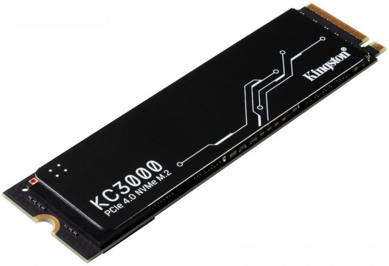
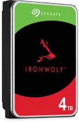

html lang="pl">
<head>
	<meta charset="utf-8" />
	<title>Komponenty komputerowe </title>
	<meta name="description" content="Serwis prezentuje komponenty komputerowe. Sprawdź, czy znasz je wszystkie" />
	<meta name="keywords" content="komputery, procesory, karty greficzne, GPU, CPU , płyta główna, ziemniak" />
	<meta http-equiv="X-UA-Compatible" content="IE=edge,chrome=1" />
	
	

</head>

<body>

	

	
		

			<h1>Komponenty komputerowe</h1>
		

		

		<a href="https://michu-sys.github.io/komp0/"> Strona Główna </a>    
			 
		    Komponenty Komputerowe:
			 
			<a href="https://michu-sys.github.io/komp1/"> -Procesor </a>  
			 
			<a href="https://michu-sys.github.io/komp3/"> -Płyta Główna </a>    
			 
			
			<a href="https://michu-sys.github.io/komp4/"> -Karta Graficzna </a>    
			 
			
		    <a href="https://michu-sys.github.io/komp2/"> -Pamięć Ram</a>    
			 
			<a href="https://michu-sys.github.io/komp5/">- Zasilacz</a> 
		
			<a href="https://michu-sys.github.io/komp6/"> -Chłodzenie </a>    
			 

		

		
		

			<h2>Dysk twardy i SSD – pamięć na dłużej</h2>
			Dysk twardy (HDD) oraz dysk SSD to komponenty służące do trwałego przechowywania danych – systemu operacyjnego, programów, gier, dokumentów czy zdjęć. HDD (ang. Hard Disk Drive) to tradycyjny dysk z ruchomymi talerzami i głowicą. Jest tańszy i pojemniejszy, ale wolniejszy i bardziej podatny na uszkodzenia mechaniczne. Z kolei SSD (ang. Solid State Drive) nie ma ruchomych części, działa na pamięci flash – dzięki czemu jest dużo szybszy, cichszy i bardziej odporny na wstrząsy. SSD przyspiesza uruchamianie systemu, ładowanie gier i programów. Nowoczesne komputery zazwyczaj korzystają z kombinacji: SSD na system + HDD na dane. Wśród SSD wyróżniamy modele na złącze SATA (starsze, wolniejsze) i M.2 NVMe (nowoczesne, bardzo szybkie). Dobór odpowiedniego dysku wpływa bezpośrednio na komfort pracy i użytkowania komputera.
			
			  
           <h3> Dysk SSD</h3>			
            

			
		

		   <h3> Dysk HDD </h3>
			            

			
		

		

		
		

			
		

		
		

			Komponenty komputerowe - Michu 3301 &copy; Wszelkie prawa zastrzeżone
		

	
	

</body>
</html>
